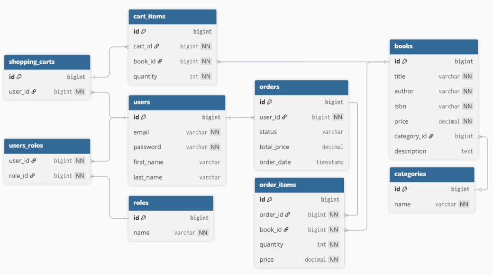

# 📚 Bookstore Application

A modern and scalable **Bookstore RESTful API** built with **Spring Boot**.  
This project provides a complete backend for managing books, users, shopping carts, and orders.  
It was inspired by the idea of building a clean, production-ready system that demonstrates authentication, authorization, relational data design, and business logic separation.

---

## 🚀 Features

- **User authentication and registration** (JWT-based)
- **Role-based access control** (ADMIN, USER)
- **Book management** — create, update, delete, view
- **Shopping cart and cart items**
- **Order management** with status tracking
- **Swagger documentation** for all endpoints
- **Docker support** for easy setup and deployment

---

## Table of contents

- [Key Technologies](#key-technologies)
- [Architecture Overview](#architecture-overview)
- [List of Controllers](#list-of-controllers)
- [Database Schema Relationship Diagram](#database-schema-relationship-diagram)
- [Fork and Clone the Project on GitHub](#fork-and-clone-the-project-on-github)
- [How to Launch the Application](#how-to-launch-the-application)
- [All Postman Collections](#all-postman-collections)

---

## Key Technologies

- **Java 17** – Primary backend programming language.
- **Maven** – Build automation and dependency management.
- **Spring Boot 3** – Provides autoconfiguration and rapid application development.
- **Spring Security 6** – Manages authentication and authorization via JWT.
- **Spring Data JPA (Hibernate)** – Simplifies database operations with ORM.
- **MapStruct** – Automatic mapping between entities and DTOs.
- **Lombok** – Reduces boilerplate code with annotations.
- **Swagger / OpenAPI** – Interactive API documentation.
- **Stripe API** – Secure payment processing.
- **Telegram Bot API** – Sends real-time user notifications.
- **Scheduler** – Handles automated background tasks.
- **PostgreSQL / H2** – Primary and in-memory databases.
- **Docker** – Ensures consistent deployment environments.
- **JUnit & MockMvc** – Unit and integration testing frameworks. 

[Back to Table of Contents](#table-of-contents)

---

## List of Controllers

### 🔐 **AuthenticationController**
Handles user registration and login.

- **POST** `/api/auth/register` — Register a new user
- **POST** `/api/auth/login` — Authenticate a user and return JWT token

### 👤 **UserController**
Manages user profiles and roles (secured endpoints).

- **GET** `/api/users/me` — Retrieve current user info
- **PUT** `/api/users/me` — Update user profile
- **GET** `/api/users` — View all users *(ADMIN only)*

### 📚 **BookController**
Manages book catalog operations.

- **GET** `/api/books` — Get all books
- **GET** `/api/books/{id}` — Get book by ID
- **POST** `/api/books` — Add a new book *(ADMIN only)*
- **PUT** `/api/books/{id}` — Update existing book *(ADMIN only)*
- **DELETE** `/api/books/{id}` — Remove book *(ADMIN only)*

### 🛒 **ShoppingCartController**
Handles user shopping cart operations.

- **GET** `/api/cart` — View user’s shopping cart
- **POST** `/api/cart` — Add a book to the cart
- **PUT** `/api/cart` — Update cart item quantity
- **DELETE** `/api/cart/{bookId}` — Remove book from cart

### 📦 **OrderController**
Manages order creation and tracking.

- **POST** `/api/orders` — Place an order
- **GET** `/api/orders` — View all user orders
- **GET** `/api/orders/{id}` — View specific order
- **PATCH** `/api/orders/{id}` — Update order status *(ADMIN only)*

[Back to Table of Contents](#table-of-contents)

---

## Database Schema Relationship Diagram



[Back to Table of Contents](#table-of-contents)

---

## Fork and Clone the Project on GitHub

Forking creates a personal copy of someone else's repository under your GitHub account.

- [Go to the GitHub page of the repository you want to fork](https://github.com/letmerelaxpls/online-book-store-app)
- Click the "Fork" button in the upper-right corner
- Select your GitHub account (or organization) to create the fork

  You now have your own copy of the project.

Make sure you have Git installed on your machine

- You can check by running:
```
git --version
```

Clone the repository to your local machine:
```
git clone https://github.com/letmerelaxpls/online-book-store-app.git
cd online-book-store-app
```

[Back to Table of Contents](#table-of-contents)

---

## How to Launch the Application

Before launching, ensure you have the following installed:

- Java 17+
- Maven 3.8+
- Docker & Docker Compose

1. Configure Environment Variables
   Create a .env file in the project root (you can copy from .env.example):
    ```
    MYSQLDB_DATABASE=database_name
    MYSQLDB_USER=user_name
    MYSQLDB_ROOT_PASSWORD=password
    MYSQLDB_LOCAL_PORT=3305
    MYSQLDB_DOCKER_PORT=3306

    SPRING_LOCAL_PORT=8081
    SPRING_DOCKER_PORT=8080

    JWT_EXPIRATION=1
    JWT_SECRET=secret
    ```
2. Run with Maven
    ```
    mvn clean package
    mvn spring-boot:run
    ```
3. Or Run with Docker Compose
    ```
   docker compose up --build
    ```
Once the application starts, open Swagger to explore the API:
```text
http://localhost:8080/api/swagger-ui/index.html
```

[Back to Table of Contents](#table-of-contents)

---

## All Postman Collections

You can import the prepared Postman collection to quickly test all API endpoints.

[Postman collections](online-book-store-app.postman_collection.json)

[Back to Table of Contents](#table-of-contents)